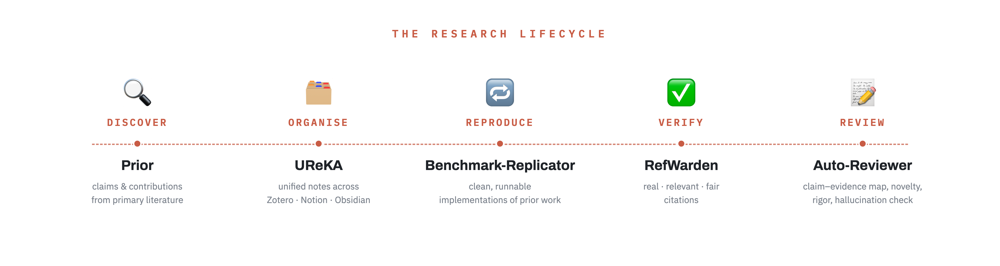

# Agents4Academia

A two-week open-source AI-for-science hackathon.

**14–26 June 2026** · Oxford (Department of Statistics) and Singapore (NUS + NTU) — hybrid via video, no travel.

We're building open-source AI agents for the parts of research that AI really should be helping with — keeping up with literature, hunting for grants, evaluating the agents themselves, cross-disciplinary translation, and whatever pain participants most want gone. Teams pitch problems on Day 1, self-organise around them, and ship working systems plus technical write-ups by the end of the fortnight.

🌐 [agents4academia.github.io](https://agents4academia.github.io)

---

## The premise

Research is a lifecycle — **find** the relevant work, **organise** what you know,
**reproduce** and benchmark it, **verify** and review it. Every stage is full of
toil that is *almost* mechanical but needs judgement. We asked a simple question:
how far can LLM agents get on each stage if you take **grounding and auditability**
seriously — no fluent-but-uncheckable answers? Five teams each took a slice — and
built their systems in two weeks, almost entirely with Claude Code.

## Teams & projects

| Project | What it does | Repo |
|---|---|---|
| **Prior** *(Team 6)* | primary literature → an auditable graph of claims & contributions (provenance · contradictions · confidence) | [prior](https://github.com/Agents4Academia-AI/prior) |
| **UReKA** *(Team 3)* | ingest Zotero/Notion/Obsidian/arXiv → a linked knowledge base + auto-built learning courses | [UReKA](https://github.com/Agents4Academia-AI/UReKA) |
| **benchmark-replicator** *(Team 1)* | paper PDF -> a clean, runnable implementation + reproduction experiments | [benchmark-replicator](https://github.com/Agents4Academia-AI/benchmark-replicator) |
| **citation-verification** *(Team 2)* | verify a draft's citations against retrieved evidence — real? metadata right? claim supported? | [citation_verification](https://github.com/Agents4Academia-AI/citation_verification) |
| **auto-reviewer** *(Team 5)* | a 10-stage Claude-API pipeline that reviews deep-learning paper PDFs (claim/evidence map, novelty + rigor checks, self-critique) into author-facing feedback; ships with a web app | [auto-reviewer](https://github.com/Agents4Academia-AI/auto-reviewer) |

## Organisers

Klara Kaleb · Harit Vishwakarma · Yee Whye Teh — all at Oxford Department of Statistics.

## Advisors

Tom Rainforth (Oxford) · Wee Sun Lee (NUS) · Luke Ong (NTU).

## Supported by

University of Oxford (Department of Statistics) · Anthropic (Claude Code licenses + Claude API credits for the cohort).
