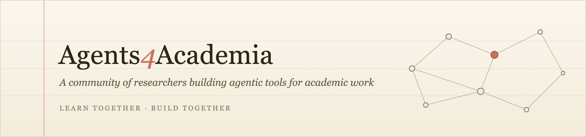

# Agents4Academia

> A community of researchers building and critically understanding agentic tools for academic work.

&nbsp;&nbsp;&nbsp;
&nbsp;&nbsp;&nbsp;

AI agents (Claude, Codex, etc.) are changing what individuals can build and accomplish. Researchers can turn an idea, a recurring frustration, or a highly specific workflow into a working tool in a fraction of the time previously required.

Across academia, people are experimenting with agents for literature discovery, knowledge organisation, coding, reproducibility, review, teaching, and administration. But much of this work remains scattered across individuals and institutions, with tools built in isolation and lessons rarely shared.

**Agents4Academia** is a community for bringing these efforts together: sharing practical experiences, identifying common needs, and developing open, reusable agentic tools shaped by researchers themselves.

## Our goals are simple:

1. **Learn together** where agents add real value, where their limitations lie, and how best practices should evolve as the technology improves.
2. **Build together** open and reusable tools for shared academic needs, adapting them over time to new capabilities and ways of working.

We welcome researchers and collaborators from all institutions and disciplines to contribute to this shared effort.

## Our principles

We have an initial set of principles guiding our work in this community. These may evolve over time.

**Human agency and accountability.** Agents should support researchers, not replace judgement, responsibility, intellectual ownership and accountability.

**Value and meaning over AI Slop.** The goal is not simply to produce more text, code, experiments, or papers. The automation should help us in creating more value and meaningful work.

**Safety and reliability.** Research agents should be reliable, transparent about their sources and uncertainty, and designed so that their outputs can be checked and traced.

**Accessible and open.** Useful agentic tools should be accessible to institutions and researchers even with limited resources or funding. We encourage open-source tools, open-weight and low-cost models, and solutions that can adapt to different disciplines.

**Community-driven.** The future of agentic academia should be shaped by researchers themselves. We value shared tools, open collaboration, diverse perspectives, and solutions developed around real academic needs.

## Get involved

- **Try the tools.** Each repository includes setup instructions and examples.
- **Contribute.** Pull requests, evaluations, integrations, and tests on new domains are welcome.
- **Build on the shared infrastructure.** Use [academia-core](https://github.com/Agents4Academia-AI/academia-core) for your own research agents.
- **Add your project.** Built an agent for academic work? Bring it into the ecosystem — see [how to join](https://github.com/Agents4Academia-AI/.github/blob/main/ECOSYSTEM.md).
- **Organise a chapter.** Run an Agents4Academia hackathon at your institution.
- **Join the next cohort.** We are planning the next hackathon.
- **Join the conversation.** Find us on [Discord](https://discord.gg/fEDXaSWwj), [X](https://x.com/agents4academia), and [Bluesky](https://bsky.app/profile/agents4academia.bsky.social).

## Our first cohort (Oxford–Singapore Hackathon, June 2026)

Our first cohort launched with a two-week hackathon (14–26 June 2026), running in parallel across Oxford Statistics, NUS, and NTU with generous support from Anthropic. We deliberately didn't pre-assign projects: participants identified concrete bottlenecks in their own scientific workflows and self-organised into small teams around them, so the work reflects researchers' real, felt needs rather than an imposed agenda.

The hackathon shipped five open-source agents spanning the research lifecycle:

|  | Stage | Project | What it does |
| --- | --- | --- | --- |
| 🔍 | **Discover** | [Prior](https://github.com/Agents4Academia-AI/prior) | Builds an auditable knowledge graph of claims and contributions from primary literature, helping researchers understand the state of a field, contradictions, and open questions. |
| 🗂️ | **Organise** | [UReKA](https://github.com/Agents4Academia-AI/UReKA) | Unifies Zotero, Notion, Obsidian, and arXiv into a linked, queryable research knowledge base. |
| 🔁 | **Reproduce** | [Benchmark-Replicator](https://github.com/Agents4Academia-AI/benchmark-replicator) | Produces clean, minimal, runnable implementations of prior empirical papers. |
| ✅ | **Verify** | [RefWarden](https://github.com/Agents4Academia-AI/citation_verification) | Checks whether references exist, whether their metadata is correct, and whether they actually support the claims they are cited for. |
| 📝 | **Review** | [Auto-Reviewer](https://github.com/Agents4Academia-AI/auto-reviewer) | Turns a paper PDF into claim–evidence maps, novelty and rigor checks, and a self-critique pass for hallucinations. |

While building side by side, the teams repeatedly encountered the same infrastructure needs. We therefore extracted them into [**academia-core**](https://github.com/Agents4Academia-AI/academia-core): shared components for full-text ingestion, citation resolution, and evidence-grounded judging that other research agents can build on.

## Acknowledgements

The first Agents4Academia hackathon was supported by **Anthropic** through Claude Code plans and API credits, and by **Oxford Statistics**, the **NUS School of Computing**, and the **NTU College of Computing and Data Science**.

Thanks to our advisors:

- [Tom Rainforth](https://www.robots.ox.ac.uk/~twgr/), Oxford
- [Wee Sun Lee](https://www.comp.nus.edu.sg/~leews/), NUS
- [Luke Ong](https://www3.ntu.edu.sg/home/luke.ong/), NTU

## Contact

Organisers:

- [Klara Kaleb](https://klarakaleb.github.io), Oxford
- [Harit Vishwakarma](https://harit7.github.io), Oxford
- [Yee Whye Teh](https://www.stats.ox.ac.uk/~teh/), Oxford
- [Wei Liu](https://weiliu876.github.io), NUS
- [Mingye Zhu](https://stevie1023.github.io), NTU
- [Yunqiao Yang](https://hustyyq.github.io), NTU

Reach us via Github or any of the above channels.
